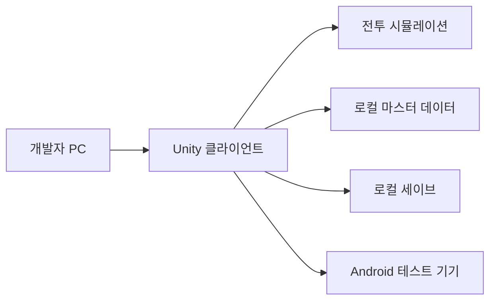
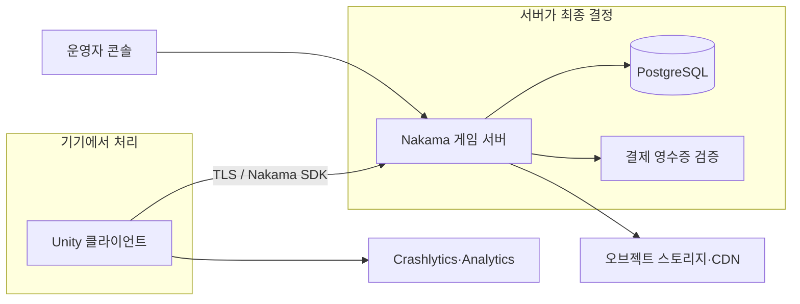

# 데스티니6 정신적 후속작 개발 준비 및 실행 계획

> 기준일: 2026년 7월 21일  
> 기본 전제: 개인 또는 소규모 팀, Android 우선, 3D 수집형 액션 RPG, 주력 3인 + 지원 1인, 탭·드래그 스킬과 브레이크 전투  
> 최우선 목표: 온라인 수집형 게임 전체를 만드는 것이 아니라, 원작의 핵심 전투가 다시 재미있는지 수직 데모로 증명하기

---

## 1. 권장안 요약

이 프로젝트는 다음 순서로 진행하는 것이 가장 현실적이다.

1. **Unity 6.3 LTS와 URP로 Android용 오프라인 전투 데모를 만든다.**
2. 무료 또는 구매 에셋으로 영웅 3명, 지원자 1명, 보스 1명을 구성한다.
3. 자동 기본 공격, 수동 이동, 탭·드래그 조준, 약점 노출, 브레이크, 집중 공격만 구현한다.
4. 8~12주 동안 전투 손맛을 검증한다.
5. 재미가 확인되면 영웅 성장, 로컬 저장, 스테이지와 메타 게임을 추가한다.
6. 계정·클라우드 저장·비동기 PvP가 실제로 필요해질 때 Nakama와 PostgreSQL을 붙인다.
7. 실시간 PvP·길드전·레이드는 판매 가능한 싱글 플레이 또는 비동기 버전 이후에 검토한다.

### 최종 권장 기술 구성

| 영역 | 권장 선택 | 도입 시점 |
|---|---|---|
| 게임 엔진 | Unity 6.3 LTS | 즉시 |
| 렌더링 | Universal Render Pipeline(URP) | 프로젝트 생성 시 |
| 언어 | C# | 즉시 |
| 개발 IDE | Visual Studio 2022 또는 JetBrains Rider | 즉시 |
| 입력 | Unity Input System | 첫 주 |
| 카메라 | Cinemachine | 첫 주 |
| 콘텐츠 로딩 | Addressables | 수직 데모 후반부터 |
| 로컬 데이터 | ScriptableObject + 버전 관리 JSON | 즉시 |
| 로컬 저장 | 초기 JSON, MVP부터 SQLite 검토 | 1~4개월 |
| 버전 관리 | Git + Git LFS + GitHub 비공개 저장소 | 첫날 |
| 3D 제작 | Blender | 즉시 |
| UI 설계 | Figma 또는 Penpot | 1~2주 |
| 텍스처 | Photoshop/Krita, 필요 시 Substance 3D Painter | 에셋 제작 시 |
| 서버 | 초기에는 없음, 이후 Nakama | 4~8개월 이후 |
| 서버 런타임 | Nakama TypeScript 또는 Go | 온라인 기능 도입 시 |
| 운영 DB | PostgreSQL | 서버와 함께 |
| 캐시 | Redis는 초기 불필요 | 실제 병목 발생 후 |
| 파일 배포 | Addressables + Google Play Asset Delivery 또는 오브젝트 스토리지/CDN | 콘텐츠가 커질 때 |
| 장애 분석 | Firebase Crashlytics | 외부 테스트 직전 |
| 분석 | Firebase Analytics 또는 별도 이벤트 수집 | 알파 테스트부터 |
| 자동 빌드 | GitHub Actions 또는 Unity Build Automation | 팀원이 2명 이상일 때 |

Unity 공식 자료상 6.3 LTS는 2027년 12월까지 지원되며, 제작 버전을 고정해야 하는 라이브 게임에 LTS가 권장된다. Unity Personal은 최근 12개월 매출·투자금 20만 달러 미만 개인 및 소규모 조직에 무료이고 Unity 6에는 런타임 요금이 없다.

---

## 2. 먼저 결정해야 할 제품 범위

기술을 설치하기 전에 아래 세 가지 중 어느 게임을 만들 것인지 정해야 한다. 권장안은 B다.

| 안 | 형태 | 서버 | 난이도 | 권장도 |
|---|---|---:|---:|---:|
| A | 개인용 전투 복원·샌드박스 | 없음 | 낮음 | 전투 연구용으로 좋음 |
| **B** | 싱글 플레이 중심 수집형 RPG + 선택적 클라우드 저장 | 최소 | 중간 | **가장 권장** |
| C | 뽑기·길드·PvP·레이드가 있는 라이브 서비스 | 필수 | 매우 높음 | 경험 있는 팀이 아니면 보류 |

### 권장 제품 정의

> 3명의 영웅과 1명의 지원자를 편성하고, 자동 교전 중 적의 균열 순간에 드래그 스킬로 브레이크를 일으키는 Android 우선 3D 액션 RPG. 메인 캠페인은 오프라인으로 완주할 수 있고, 계정과 순위 기능은 선택적으로 연결한다.

이 정의는 원작의 전투 감각을 보존하면서도 서비스 종료 시 플레이 자체가 사라지는 문제를 피한다.

### 1차 출시에서 제외할 것

- 실시간 길드전
- 5인 동시 레이드
- 글로벌 채팅
- 복잡한 뽑기와 결제 서버
- 100명 이상의 영웅
- 캐릭터별 타입 3종 모델
- 실시간 콘텐츠 패치 운영 도구 전체
- iOS 동시 출시
- PC·콘솔 동시 지원

이 항목들은 전투가 검증된 뒤에도 필요성과 비용을 다시 평가해야 한다.

---

## 3. 전체 기술 구조

### 3.1 처음 3개월



이 단계에는 서버, 클라우드 DB, Redis, Kubernetes가 필요 없다. 서버를 먼저 만들면 정작 중요한 전투 테스트가 늦어진다.

### 3.2 온라인 기능 추가 후



### 3.3 서버가 결정해야 하는 데이터

온라인·과금형으로 발전한다면 다음은 클라이언트가 아니라 서버가 최종 권한을 가져야 한다.

- 유료·무료 재화 잔액
- 영웅 획득과 중복 보상
- 인벤토리 추가·소비
- 소환 결과와 천장 횟수
- 결제 영수증
- 랭킹 점수
- PvP 결과
- 길드 가입·탈퇴·보상
- 우편과 운영 보상
- 이벤트 보상 수령 여부

클라이언트가 DB에 직접 연결하면 안 된다. Unity 클라이언트는 인증 토큰으로 서버 API를 호출하고, DB 계정과 비밀 키는 서버 환경에만 둔다.

---

## 4. 개발 장비와 계정

### 4.1 권장 개발 PC

| 부품 | 최소 | 권장 |
|---|---|---|
| CPU | 6코어급 | 8~12코어 최신 CPU |
| RAM | 16GB | 32GB, 대형 3D 작업은 64GB |
| GPU | DirectX 11 지원 4GB VRAM | RTX 4060·RX 7600급 이상, 8GB VRAM |
| 저장장치 | SSD 500GB | NVMe 1~2TB + 별도 백업 드라이브 |
| 모니터 | FHD 1대 | QHD 2대 또는 QHD + 테스트 화면 |
| 네트워크 | 일반 광대역 | 유선 연결과 별도 모바일 회선 테스트 |

Unity 편집기, Android 빌드, Blender, 텍스처 툴을 동시에 사용하려면 RAM 32GB와 NVMe 1TB가 체감상 가장 중요하다.

### 4.2 테스트 기기

최소 세 등급의 실제 Android 기기가 필요하다.

| 등급 | 목적 |
|---|---|
| 저사양 | 메모리, 발열, 30fps, 로딩 실패 확인 |
| 중급 | 실제 목표 품질과 60fps 판단 |
| 고급 | 최고 옵션, 고주사율, 고해상도 UI 확인 |

추가로 화면비가 긴 기기, 태블릿, 노치·펀치홀 기기 중 하나를 포함한다. 에뮬레이터는 입력과 성능 검증을 대체하지 못한다.

### 4.3 만들어 둘 계정

- Unity ID
- GitHub 계정과 비공개 저장소
- Google 계정
- Firebase 프로젝트 계정
- Google Play Console 계정은 외부 배포가 가까워졌을 때 생성
- iOS 출시를 확정했을 때 Apple Developer 계정
- 도메인과 프로젝트 전용 이메일은 공개 테스트 직전

Google Play의 전체 배포 개발자 계정은 현재 25달러 일회성 등록비가 있으며, 신규 개인 계정에는 본 배포 전 테스트와 기기 확인 요건이 있다. Apple Developer Program은 연 99달러다. 개인 테스트 단계에서는 스토어 계정을 서둘러 만들 필요가 없다.

---

## 5. 개발 프로그램 설치 목록

### 필수

1. Unity Hub
2. Unity 6.3 LTS
3. Android Build Support
4. Unity가 권장하는 Android SDK, NDK, OpenJDK
5. Visual Studio 2022 또는 Rider
6. Git
7. Git LFS
8. Blender
9. 이미지 편집 프로그램
10. 화면 녹화·프레임 분석 도구

Unity Hub의 Android Build Support를 설치하면 버전에 맞는 SDK·NDK·OpenJDK 구성을 함께 관리할 수 있다. 임의로 최신 NDK를 덮어쓰지 말고 해당 Unity 패치가 지원하는 버전을 사용한다.

### Unity 패키지

| 패키지 | 용도 | 도입 판단 |
|---|---|---|
| URP | 모바일용 조명과 렌더링 | 필수 |
| Input System | 터치·드래그·패드 입력 통합 | 필수 |
| Cinemachine | 보스 카메라와 브레이크 연출 | 권장 |
| Addressables | 캐릭터·맵 비동기 로딩과 배포 | 권장 |
| TextMeshPro | UI 텍스트 | 필수 |
| Test Framework | 전투 공식과 데이터 검증 | 필수 |
| Localization | 다국어 가능성이 있을 때 | MVP 이후 |
| Animation Rigging | 조준·무기 보정이 필요할 때 | 선택 |

초기에는 DOTS/ECS, 커스텀 렌더 파이프라인, 복잡한 네트워크 프레임워크를 도입하지 않는다. 영웅과 적 수가 한 화면에 많지 않은 3+1 전투는 일반 GameObject 구조로도 충분히 검증할 수 있다.

---

## 6. 프로젝트 생성 규칙

### 6.1 기본 설정

- 템플릿: 3D URP
- 컬러 공간: Linear
- 주 플랫폼: Android
- 기본 방향: Landscape
- 스크립팅 백엔드: 개발 중 Mono, 출시 빌드 IL2CPP 검토
- 아키텍처: ARM64 필수, 목표 시장에 따라 ARMv7 판단
- 목표 프레임: 중급기 60fps, 저사양 30fps 옵션
- 해상도: 내부 렌더 스케일 조절 가능하게 설계
- 그래픽 API: 우선 OpenGL ES 3, 충분히 시험 후 Vulkan 병행

### 6.2 폴더 구조 예시

```text
Assets/
├─ Game/
│  ├─ Art/
│  │  ├─ Characters/
│  │  ├─ Environments/
│  │  ├─ VFX/
│  │  └─ UI/
│  ├─ Audio/
│  ├─ Data/
│  │  ├─ Heroes/
│  │  ├─ Skills/
│  │  ├─ Enemies/
│  │  └─ Stages/
│  ├─ Prefabs/
│  ├─ Scenes/
│  │  ├─ Boot/
│  │  ├─ Lobby/
│  │  └─ Battle/
│  ├─ Scripts/
│  │  ├─ Core/
│  │  ├─ Battle/
│  │  ├─ Input/
│  │  ├─ UI/
│  │  ├─ Meta/
│  │  └─ Infrastructure/
│  └─ Tests/
└─ ThirdParty/
```

게임 코드와 외부 에셋을 분리하고, 원작 연구용 이미지나 파일은 Unity 프로젝트 밖의 별도 `reference/` 저장소에 둔다. 그래야 실수로 배포 빌드에 포함되지 않는다.

### 6.3 버전 관리

- Git 저장소는 프로젝트 생성 첫날 만든다.
- Unity용 `.gitignore`를 적용한다.
- `Library`, `Temp`, `Logs`, 빌드 결과는 커밋하지 않는다.
- FBX, PSD, WAV, 대형 PNG, Blender 파일은 Git LFS로 추적한다.
- 기본 브랜치를 항상 실행 가능한 상태로 유지한다.
- 기능 하나당 짧은 브랜치와 작은 커밋을 사용한다.
- 매일 원격 저장소에 푸시하고 주 1회 별도 백업을 만든다.

GitHub 공식 문서는 Git LFS가 큰 파일 대신 포인터를 Git 저장소에 보관하는 방식임을 설명한다. 3D 게임은 바이너리 파일이 빠르게 커지므로 시작부터 LFS 규칙을 잡아야 한다.

---

## 7. 클라이언트 시스템 개발 순서

### 7.1 전투 코어

다음 순서가 중요하다.

1. 전투 유닛 상태와 능력치
2. 자동 타깃 탐색
3. 자동 이동과 기본 공격
4. 수동 이동 패드
5. 스킬 재사용 대기시간
6. 탭 즉시 사용
7. 홀드·드래그 조준
8. 범위 판정
9. 보스 행동 상태 머신
10. 약점 노출과 브레이크
11. 무력화와 집중 공격 보너스
12. 스트라이커 충전과 호출
13. 자동 스킬 정책
14. 전투 결과와 리플레이 로그

### 7.2 전투 코드는 표현과 분리

```text
Battle Simulation
├─ 능력치·피해·브레이크 계산
├─ 스킬 상태와 재사용 시간
├─ 타깃과 범위 판정
├─ AI 의사결정
└─ 전투 이벤트 생성

Presentation
├─ 모델과 애니메이션
├─ 이펙트와 사운드
├─ UI
├─ 카메라와 진동
└─ 전투 이벤트 재생
```

피해 계산에서 애니메이션을 직접 호출하지 않는다. 계산 계층이 `SkillHit`, `BreakSuccess`, `UnitDead` 같은 이벤트를 만들고 표현 계층이 이를 보여주게 한다. 이 분리는 자동 테스트, 리플레이, 서버 검증을 쉽게 만든다.

### 7.3 데이터 구조

정적 데이터와 플레이어 데이터를 분리한다.

#### 정적 마스터 데이터

- 영웅 정의
- 스킬 정의
- 적과 보스 패턴
- 스테이지와 드롭 테이블
- 성장 비용
- 상성표
- 번역 텍스트

ScriptableObject로 편집하되 빌드·서버 공유용 JSON으로 내보낼 수 있게 만든다. 모든 데이터에는 안정적인 문자열 또는 정수 ID와 데이터 버전을 둔다.

#### 플레이어 데이터

- 보유 영웅 인스턴스
- 레벨·승급·각성
- 장비와 유물
- 파티 프리셋
- 스테이지 진행
- 설정과 튜토리얼 상태

초기에는 버전이 포함된 JSON 저장으로 충분하다. 데이터가 많아지고 검색·부분 갱신이 필요해지면 SQLite를 검토한다. 저장 파일 암호화는 치팅을 완전히 막지 못하므로 개인용·오프라인 버전에서는 손상 방지와 백업을 우선한다.

---

## 8. 서버와 백엔드 선택

### 8.1 언제 서버가 필요한가

| 기능 | 서버 필요성 |
|---|---|
| 싱글 캠페인 | 불필요 |
| 로컬 수집·성장 | 불필요 |
| 선택적 클라우드 백업 | 간단한 서비스 필요 |
| 계정 연동 | 필요 |
| 친구·랭킹 | 필요 |
| 비동기 PvP | 필요 |
| 실시간 PvP·레이드 | 권위 서버 필요 |
| 인앱 결제와 재화 | 서버 검증 강력 권장 |
| 길드·채팅·우편 | 필요 |

### 8.2 후보 비교

| 선택 | 장점 | 단점 | 적합한 경우 |
|---|---|---|---|
| Unity Gaming Services | Unity 통합이 빠름 | 공급자 종속, 복잡한 게임 로직 한계 | 클라우드 저장·인증을 빨리 붙일 때 |
| PlayFab | 계정·경제·데이터·운영 기능이 풍부 | 비용 구조와 종속성, 학습 필요 | 서버 담당자가 적은 상용 라이브 게임 |
| **Nakama + PostgreSQL** | 오픈소스, 계정·친구·길드·랭킹·멀티플레이 제공, 자체 보존 가능 | 배포·DB·백업을 직접 운영 | **프로젝트 통제와 장기 보존을 중시할 때** |
| 완전 자체 ASP.NET 서버 | 자유도 최고 | 개발·보안·운영 비용 최고 | 숙련된 백엔드 팀이 있을 때 |

### 8.3 권장 백엔드

이 프로젝트에는 Nakama와 PostgreSQL을 권장한다.

- 로컬 Docker 환경에서 무료로 개발 가능
- Unity SDK 제공
- 인증, 저장소, 친구, 그룹·길드, 채팅, 알림, 랭킹, 매치 기능 제공
- 서버 로직을 TypeScript, Go 또는 Lua로 작성 가능
- 클라우드 사업자를 바꿔도 데이터와 서비스를 통제 가능
- 나중에 필요하면 권위형 실시간 매치 구현 가능

Nakama 공식 문서는 이를 소셜·실시간 게임용 확장 가능한 오픈소스 백엔드로 설명하며, PostgreSQL 또는 CockroachDB를 사용할 수 있다고 안내한다.

### 8.4 서버 도입 단계

#### 개발 환경

- Docker Desktop
- Nakama 1개 인스턴스
- PostgreSQL 1개 인스턴스
- 로컬 관리 콘솔
- 가짜 결제와 테스트 계정

#### 비공개 알파

- 작은 클라우드 VM 또는 관리형 Nakama
- 관리형 PostgreSQL 또는 자동 백업 DB
- TLS 인증서
- 일일 백업과 복원 훈련
- 로그 보존과 알림

#### 공개 서비스

- 무중단 배포 또는 유지보수 모드
- 서버 런타임 버전 고정
- DB 마이그레이션 체계
- 스테이징 환경
- 비밀 키 관리
- 속도 제한
- 감사 로그
- 결제 영수증 검증
- 모니터링과 장애 대응 문서

초기 알파에 Kubernetes, 마이크로서비스 분리, 다중 리전 DB는 필요 없다. 단일 Nakama와 PostgreSQL로 시작해 측정된 병목만 해결한다.

---

## 9. 데이터베이스 설계 초안

Nakama의 기본 계정·스토리지 기능을 활용하고, 경제·감사에 중요한 정보는 명확한 테이블과 거래 기록을 둔다.

### 핵심 엔터티

```text
users
player_profiles
hero_definitions          정적 마스터
player_heroes             보유 영웅 인스턴스
item_definitions          정적 마스터
player_inventory
equipment_instances
team_presets
stage_progress
battle_results
currency_balances
currency_ledger           모든 재화 증감 기록
summon_history
reward_claims
guilds
guild_members
leaderboard_entries
purchase_receipts
mailbox
```

### 반드시 지킬 규칙

- 재화는 단순 잔액만 두지 말고 증감 원인과 거래 ID를 기록한다.
- 보상 수령 요청은 같은 요청을 두 번 보내도 한 번만 지급되도록 멱등성을 보장한다.
- 정적 영웅·스킬 데이터는 플레이어 소유 데이터와 분리한다.
- 삭제는 가능하면 소프트 삭제와 감사 기록을 사용한다.
- DB 스키마 변경은 수동 수정하지 말고 마이그레이션 파일로 관리한다.
- 백업을 만드는 것보다 실제 복원 시험이 중요하다.
- 개인정보는 필요한 최소한만 저장한다.

### Redis가 필요 없는 이유

초기 접속자 수에서 PostgreSQL과 Nakama의 메모리 기능으로 충분하다. Redis는 세션·분산 락·캐시 병목이 실제 측정됐을 때 도입한다. 미리 추가하면 운영 구성요소와 장애 지점만 늘어난다.

---

## 10. 에셋 제작 파이프라인

### 10.1 캐릭터 한 명의 산출물

- 콘셉트와 정면·측면 기준
- 모델
- 텍스처와 재질
- 리그
- 대기·이동·기본 공격
- 액티브 스킬 2개
- 피격·브레이크·사망·승리
- 스트라이커 연출
- 초상화와 스킬 아이콘
- 음성·효과음
- 프리팹과 데이터
- 저사양 LOD 또는 최적화 버전

MVP에서 영웅 수를 무리하게 늘리면 대부분의 비용이 이 단계에서 발생한다.

### 10.2 3D 기준 초안

- 4.5~5등신 스타일
- 캐릭터 재질 1~2개 중심
- 영웅당 본 수 제한
- 한 화면 동시 영웅·적 수를 기준으로 폴리곤 예산 결정
- 텍스처는 모바일 압축 포맷을 전제로 제작
- 투명 효과의 화면 점유를 제한
- 스킬 이펙트는 오브젝트 풀링 사용
- 장비 외형은 완전 교체보다 소켓·색·이펙트 변형 우선

정확한 폴리곤·텍스처 예산은 목표 기기에서 영웅 3명, 적 8명, 보스 1명, 이펙트를 동시에 띄운 성능 시험 후 정한다.

### 10.3 콘텐츠 배포

수직 데모에서는 모든 에셋을 로컬에 포함한다. 캐릭터와 지역이 늘어나면 Addressables로 묶고 다음 중 하나를 사용한다.

- Google Play Asset Delivery: Android 스토어 중심, 무료 호스팅과 차등 배포
- 오브젝트 스토리지 + CDN: 스토어 밖 업데이트와 플랫폼 공용 배포
- Unity Cloud Content Delivery: Unity 통합을 선호할 때

Google은 Unity 2019.4 이상 게임에서 Play Asset Delivery와 함께 Addressables 사용을 권장한다. 원격 카탈로그를 쓰면 앱 전체를 재설치하지 않고 에셋을 갱신할 수 있지만, 코드와 게임 규칙 변경은 별도의 앱 또는 서버 버전 관리가 필요하다.

---

## 11. 개발 단계와 기간

### 11.1 0단계: 준비와 사전 제작 — 2~4주

#### 해야 할 일

- 한 문장 기획과 제외 범위 확정
- 원작 전투 영상 분석
- 브레이크·드래그·스트라이커 규칙 문서화
- Unity·Git·Blender 설치
- 저장소와 백업 구성
- 무료 임시 에셋 선정
- 목표 Android 기기 3대 확보
- 터치 입력 시험 프로젝트 제작

#### 완료 기준

- Android 기기에서 빈 전투장이 실행된다.
- 한 캐릭터가 이동하고 적을 자동 공격한다.
- 팀 전체가 같은 범위와 용어를 사용한다.

### 11.2 1단계: 전투 프로토타입 — 6~8주

#### 범위

- 캡슐 또는 임시 캐릭터 3명
- 일반 적 2종
- 보스 1종
- 자동 이동·기본 공격
- 수동 이동
- 탭·드래그 스킬
- 브레이크와 무력화
- 스트라이커 1개
- 디버그 HUD

#### 완료 기준

- 보스 패턴을 보고 브레이크 성공·실패를 구분할 수 있다.
- 드래그 조준 오작동이 드물다.
- 10명 중 다수가 설명 후 다시 플레이하고 싶다고 답한다.
- 중급 Android 기기에서 목표 프레임을 유지한다.

### 11.3 2단계: 수직 데모 — 8~12주

#### 범위

- 완성 품질 영웅 3명 + 지원자 1명
- 일반 적 3~5종, 정예 1종, 보스 1종
- 로비, 편성, 전투, 결과 화면
- 간단한 레벨과 유물
- 10~15분짜리 지역 하나
- 사운드·카메라·진동·튜토리얼
- 로컬 저장
- 성능 프로파일링

#### 완료 기준

- 외부 사람이 도움 없이 시작해 보스를 처치한다.
- 플레이어가 브레이크용과 피해용 스킬을 구분한다.
- 전투의 대표 장면을 30초 영상으로 설명할 수 있다.
- 치명적 충돌과 저장 손상이 없다.

### 11.4 3단계: MVP — 4~8개월

#### 범위

- 영웅 8~12명
- 지역 3~4개
- 스테이지 24~36개
- 보스 4~6종
- 성장·각성·유물
- 도전 탑과 거인 사냥
- 접근성·옵션·소탕
- Addressables
- Crashlytics와 분석 이벤트
- 비공개 Android 테스트

#### 완료 기준

- 캠페인을 처음부터 끝까지 플레이할 수 있다.
- 데이터 초기화 없이 버전 업데이트가 가능하다.
- 최소 20~50명이 2주 이상 테스트한다.
- 크래시 없는 사용자 비율과 기기별 성능을 측정한다.

### 11.5 4단계: 온라인 확장 — 3~6개월 추가

- Nakama와 PostgreSQL
- 계정과 클라우드 저장
- 서버 권한 인벤토리·재화
- 비동기 PvP
- 친구·랭킹
- 운영 보상과 우편
- 관리자 도구
- 백업과 복원

실시간 레이드와 길드전은 이 단계가 안정된 뒤 별도 프로젝트처럼 계획한다.

---

## 12. 예상 전체 기간

| 구성 | 수직 데모 | 플레이 가능한 MVP | 온라인 소프트론칭 |
|---|---:|---:|---:|
| 1인, 파트타임 | 6~10개월 | 18~30개월 | 권장하지 않음 |
| 1인, 풀타임 + 외주 | 4~6개월 | 12~18개월 | 18~30개월 |
| 3~4인 소규모 팀 | 3~5개월 | 9~14개월 | 15~24개월 |
| 6~8인 경험 팀 | 2~4개월 | 7~12개월 | 12~18개월 |

원작 수준의 300명 이상 영웅과 장기 라이브 콘텐츠는 위 MVP와 전혀 다른 규모다. 첫 게임은 영웅 8~12명으로 완결된 캠페인을 만드는 것이 현실적이다.

### 준비 기간만 따로 보면

- 개발 경험이 있는 개인: 2~4주
- Unity 3D가 처음인 개인: 기초 학습을 포함해 6~12주
- 새로 모인 팀: 역할·파이프라인 합의를 포함해 4~8주

준비 기간에 모든 설계를 완성하려 하지 않는다. 전투 프로토타입을 만들며 사양을 확정한다.

---

## 13. 필요한 인력

### 최소 팀

| 역할 | 주요 책임 |
|---|---|
| 게임플레이 개발 | 전투, 입력, AI, 카메라, 최적화 |
| 3D 아트·애니메이션 | 캐릭터, 리깅, 애니메이션, 배경 |
| 기획·콘텐츠 | 영웅, 스킬, 보스, 성장, 밸런스 |
| UI·2D·VFX | 화면 설계, 아이콘, 효과, 가독성 |

한 사람이 여러 역할을 겸할 수 있지만, 해야 할 일 자체가 없어지는 것은 아니다.

### 온라인 서비스 추가 인력

- 백엔드 개발
- 인프라·배포·DB 운영
- QA와 기기 테스트
- 고객 지원과 커뮤니티 운영
- 데이터 분석
- 결제·스토어·정책 대응

개인 프로젝트라면 서버 기능을 줄이는 것이 사람을 추가하는 것보다 효과적이다.

---

## 14. 비용의 크기

정확한 금액은 자체 작업 비율과 목표 품질에 따라 크게 달라진다. 아래는 노동비를 제외하거나 외주 수준별로 본 대략적인 준비 범위다.

| 단계 | 현금 지출 예시 |
|---|---:|
| 기존 PC로 개인 프로토타입 | 0~100만원 |
| 장비·에셋·사운드를 보강한 수직 데모 | 100~500만원 |
| 캐릭터·애니메이션 일부 외주 수직 데모 | 1,500만~6,000만원 이상 |
| 3~6인 상용 MVP | 인건비를 포함하면 수억원 규모 가능 |
| 라이브 서비스 | 개발비 외 매월 서버·운영·콘텐츠 비용 발생 |

비용을 줄이는 가장 큰 방법은 무료 툴이 아니라 영웅 수, 고유 애니메이션 수, 온라인 기능을 줄이는 것이다.

### 초기 서버비 추정

- 로컬 개발: 사실상 무료
- 소수 비공개 알파: 월 수만~수십만원
- 공개 베타: 트래픽·DB·로그·백업에 따라 월 수십만~수백만원
- 실시간 전투와 대규모 이벤트: 동접과 지역 수에 따라 별도 산정

서버비보다 운영 인력과 지속적인 3D 콘텐츠 제작비가 더 큰 위험이다.

---

## 15. 품질과 테스트 계획

### 자동 테스트

- 피해 공식
- 상성 배율
- 브레이크 수치와 무력화 시간
- 쿨타임과 자원
- 보상 중복 수령
- 저장 데이터 버전 변환
- 마스터 데이터 ID 중복·누락
- 모든 스킬의 대상 조건

### 기기 테스트

- 장시간 발열
- 메모리 부족과 백그라운드 복귀
- 통화·알림 후 재개
- 네트워크 단절
- 저장 중 앱 종료
- 다양한 화면비
- 30fps와 60fps 입력 차이
- 저사양 이펙트 옵션

### 플레이 테스트 핵심 지표

- 약점 표시 인지율
- 첫 보스 브레이크 성공률
- 드래그 취소·오조준률
- 자동과 수동 전환 횟수
- 스킬을 브레이크 전에 낭비한 비율
- 패배 원인 이해도
- 재도전률
- 영웅·스트라이커 편성 다양성

---

## 16. 주요 위험과 대응

| 위험 | 징후 | 대응 |
|---|---|---|
| 범위 폭증 | 영웅·모드 계획이 계속 늘어남 | 수직 데모 완료 전 메타 콘텐츠 금지 |
| 전투가 관전형으로 변함 | 자동 전투에서 화면을 볼 이유가 없음 | 브레이크와 회피가 보상을 바꾸도록 설계 |
| 반복 피로 | 매일 같은 보스를 수동 플레이 | 소탕·자동 정책·첫 클리어 수동 구조 |
| 아트 병목 | 코드보다 모델·애니메이션 대기 시간이 김 | 모듈형 베이스, 공용 리그, 영웅 수 제한 |
| 모바일 성능 | 에디터에서는 되지만 기기에서 발열 | 첫 달부터 실제 기기 프로파일링 |
| 데이터 파손 | 업데이트 후 세이브 불가 | 저장 버전과 마이그레이션 테스트 |
| 서버 과설계 | 전투보다 인프라 작업이 앞섬 | 3개월간 서버 도입 금지 원칙 |
| 치팅 | 재화와 결과를 클라이언트가 결정 | 온라인 전환 시 경제를 서버 권한으로 이전 |
| 서비스 종료 의존 | 서버 없이는 캠페인 불가 | 오프라인 캠페인과 내보내기 가능한 세이브 |
| 원작 자료 혼입 | 참고 파일이 빌드에 포함됨 | reference 저장소와 배포 프로젝트 분리 |

---

## 17. 첫 30일 실행표

### 1주차: 기반

- 프로젝트 범위를 A·B·C 중 B로 고정
- Unity 6.3 LTS와 Android 모듈 설치
- Git·Git LFS·비공개 원격 저장소 구성
- URP 프로젝트 생성
- Android 기기에서 첫 빌드
- 기본 폴더와 코딩 규칙 작성

### 2주차: 이동과 자동 공격

- 전투장과 카메라
- 영웅 1명, 적 1명
- 자동 타깃과 접근
- 기본 공격과 피해
- 수동 이동 패드
- 프레임·메모리 측정 HUD

### 3주차: 스킬 입력

- 스킬 아이콘과 쿨타임
- 탭 즉시 사용
- 길게 누르기와 드래그
- 원형·직선 범위 미리보기
- 취소 영역과 손가락 가림 보정
- Android 터치 오조작 기록

### 4주차: 첫 브레이크

- 보스 상태 머신
- 공격 예고
- 약점 노출
- 브레이크 스킬
- 성공 시 행동 취소·경직·카메라·사운드
- 실패 시 위험 기술
- 3~5명에게 설명 없이 플레이 테스트

### 30일 완료 기준

> Android 실제 기기에서 캐릭터가 자동 공격하고, 플레이어가 보스의 약점을 보고 드래그 스킬로 브레이크할 수 있다.

이 결과가 나오기 전에는 로그인, DB, 뽑기, 상점, 길드를 만들지 않는다.

---

## 18. 준비해야 할 문서

코딩 전 수백 페이지 기획서는 필요 없지만 다음 문서는 반드시 있어야 한다.

1. **원페이지 게임 정의** — 핵심 재미, 대상 플랫폼, 제외 범위
2. **전투 규칙서** — 이동, 타깃, 스킬, 브레이크, 패배 조건
3. **영웅 키트 양식** — 역할, 액티브 2개, 패시브, 스트라이크
4. **보스 패턴 양식** — 예고, 회피, 약점, 브레이크, 단계 변화
5. **아트 가이드** — 비율, 색, 재질, 카메라, 이펙트 가독성
6. **기술 결정 기록** — 왜 Unity·URP·Nakama를 선택했는지
7. **데이터 사전** — ID 규칙과 저장 필드
8. **테스트 체크리스트** — 기기, 성능, 입력, 저장
9. **콘텐츠 제작표** — 영웅 하나에 필요한 모든 산출물
10. **위험 목록** — 범위, 성능, 서버, 아트, 일정

문서는 구현과 함께 갱신한다. 코드와 다른 오래된 기획서는 없는 것보다 위험하다.

---

## 19. 현재 당장 준비할 것

### 이번 주

- 개발 PC 사양 확인
- Android 테스트 기기 최소 1대 확보
- Unity 6.3 LTS 설치
- GitHub 비공개 저장소 생성
- 프로젝트 이름과 패키지 ID 임시 결정
- 3D 임시 캐릭터 에셋 1종 선택
- 원작 전투 영상에서 브레이크 장면 20개 기록

### 이번 달

- Android 첫 빌드
- 자동 공격
- 수동 이동
- 탭·드래그 스킬
- 보스 약점과 브레이크
- 최소 5명 플레이 테스트

### 3개월 안

- 영웅 3명과 스트라이커
- 완주 가능한 보스전
- 전투 결과와 간단한 성장
- 중급기 60fps 또는 안정적인 30fps
- 계속 제작할지 판단할 수 있는 플레이 영상과 테스트 자료

---

## 20. 최종 판단

이 게임을 만드는 데 가장 먼저 필요한 것은 서버나 DB가 아니다. **Unity 프로젝트, Android 실기기, Git 저장소, 임시 3D 에셋, 그리고 브레이크 전투를 8~12주 안에 검증하는 일정**이다.

서버는 재미를 만들지 않는다. 계정과 경제, 경쟁을 안전하게 유지하는 도구다. 전투가 검증되기 전에 서버를 만들면 개발 기간은 늘지만 게임의 성공 가능성은 거의 올라가지 않는다.

따라서 첫 목표는 다음 하나로 고정한다.

> 30일 안에 Android 기기에서 자동 교전 중 보스의 약점을 보고 드래그 스킬로 브레이크하는 장면을 만든다.

이 장면이 재미있으면 3개월 수직 데모로 확장한다. 수직 데모가 재미있으면 8~12명 규모의 영웅 로스터와 완결된 싱글 플레이 MVP를 만든다. 그 후 실제 이용자가 클라우드 저장, PvP, 길드를 원할 때 Nakama와 PostgreSQL을 도입한다.

---

## 21. 공식 참고 자료

- [Unity 6 릴리스와 LTS 지원 정책](https://unity.com/releases/unity-6/support)
- [Unity 6.3 LTS 소개](https://unity.com/releases/unity-6)
- [Unity Personal 자격과 가격](https://unity.com/products/unity-personal)
- [Unity 6 Android 시스템 요구사항](https://docs.unity3d.com/6000.0/Documentation/Manual/system-requirements.html)
- [Unity Android 개발환경 설정](https://docs.unity3d.com/6000.1/Documentation/Manual/android-sdksetup.html)
- [Unity Cloud Save 시작 안내](https://docs.unity.com/en-us/cloud-save/get-started)
- [Unity Addressables 원격 콘텐츠 배포](https://docs.unity3d.com/kr/Packages/com.unity.addressables%401.21/manual/remote-content-intro.html)
- [Google Play Asset Delivery와 Unity](https://developer.android.com/guide/playcore/asset-delivery/integrate-unity)
- [Android Unity 게임 개발 및 Play Integrity](https://developer.android.com/games/engines/unity/unity-on-android)
- [Nakama 공식 소개와 기능](https://heroiclabs.com/docs/nakama/)
- [Nakama 실시간·권위형 멀티플레이](https://heroiclabs.com/docs/nakama/concepts/multiplayer/)
- [Nakama와 PostgreSQL 설치 구조](https://heroiclabs.com/docs/nakama/getting-started/install/linux/)
- [PlayFab 인증 개요](https://learn.microsoft.com/en-us/xbox/playfab/identity/player-identity/authentication/)
- [Firebase Crashlytics](https://firebase.google.com/docs/crashlytics)
- [Firebase Crashlytics Unity 설정](https://firebase.google.com/docs/crashlytics/unity/get-started)
- [GitHub Git LFS 설명](https://docs.github.com/en/repositories/working-with-files/managing-large-files/about-git-large-file-storage)
- [Google Play Console 등록](https://support.google.com/googleplay/android-developer/answer/6112435)
- [Apple Developer Program 등록](https://developer.apple.com/programs/enroll/)
